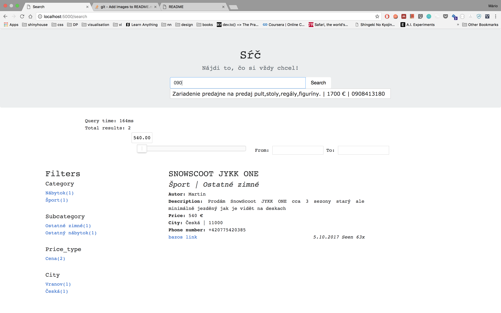

# SK Search

Full text search v slovencine implementovany s pomocou Flask+Elasticsearch.  

**Funkcionalita** 
- filtre - datum, cena
- aggregacie - kategorie, mesto
- vyhladavanie nad viacerymi fieldami (cislo, description, header)

Pre spustenie projektu - `docker-compose up`.  
V prehliadaci na `localhost:5000` by mal byt pristupny vyhladavac.



# Docker-compose issue

V pripade problemov s compose file-om:
1. Nainstalovat virtual env a spustit web appku
```
> virtualenv . venv
> . venv/bin/activate
> pip3 install -r requirements.txt
> sh run_app.sh
```

2. Nainstalovat elasticsearch a nahrat data
```
> docker build . -f elastics.Dockerfile elasticslemma
> docker run --name elasticslemma -p 9200:9200 elasticslemma
> . venv/bin/activate
> python3 import_data.py --all
```


